# multirotor

***

## The first day ——12.10

### 1.install vmware-workstation and ubuntu

* swap sources and 换输入法

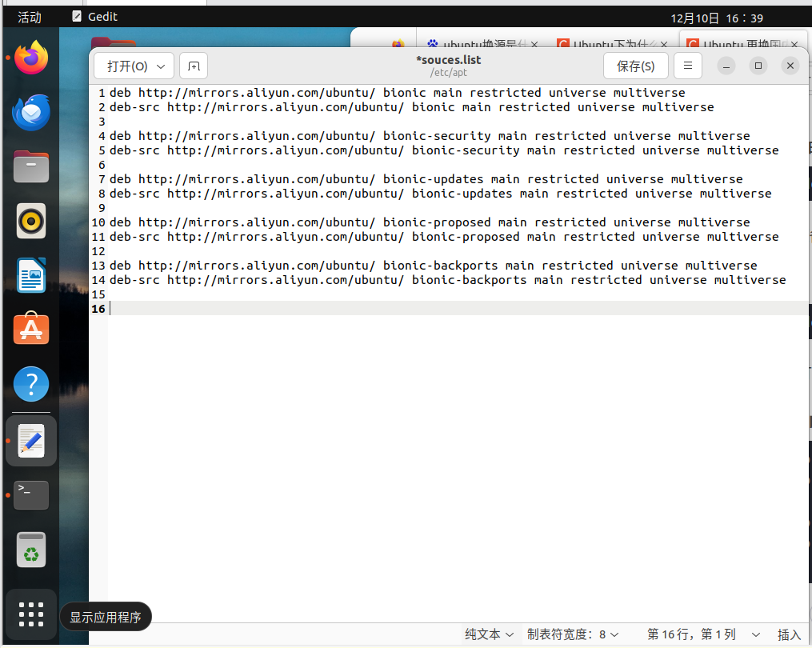
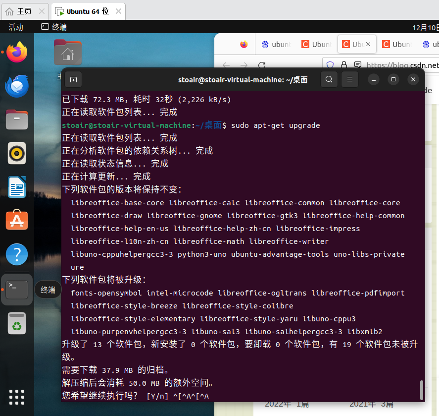

### 2.learn git

* github关联远程仓库

### 3.install and use Typora

### Git

|code|meaning|
|:------|:-----------|
|mkdir test|创建目录|
|cd test|进入目录|
|git init|初始化仓库|
|ls ；ls -ah|查看目录|
|touch test.c|新建项目|
|add|添加到缓存|
|commit -m "words"|提交到库|
|log|提交历史|
|status|查看仓库状态|
|checkout -- file|回到最近修改状态|
|rm ；rm -rf file|删除|
|reset+checkout|恢复文件|
|checkout -b dev|创建分支+切换|
|merge|合并|
|branch -a|查看分支|
|branch -D|删除分支|
|branch -m|修改分支名|
|clone|远程仓库关联到本地|
|push origin branch|修改提交|
|fetch origin branch|下载远程代码到本地|
|git merge origin/branch|远程与本地合并|

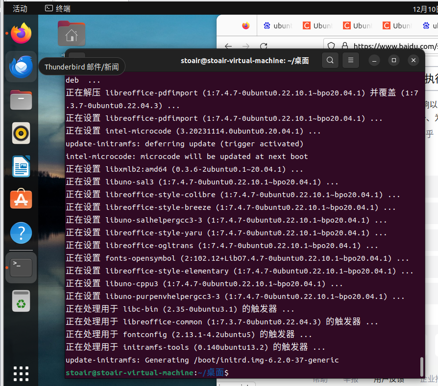
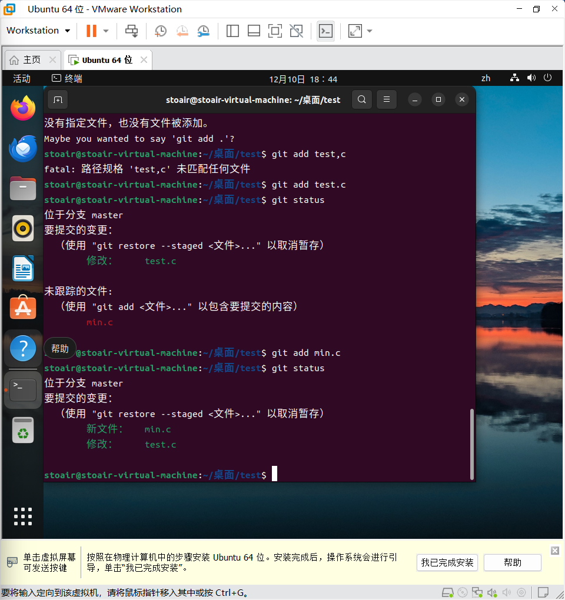

***


## The second day——12.11

### 1. install and learn g++

- question 1: unable to install g++(软件包有未依赖的关系)
- solve :swap sources;

### 2. c++ printf  "hello world"

- question 2 :unable to edit helloworld.cpp
- solve :learn vim (  --,--  ;   gedit is better  )
***
- question 3 :unable to compile and run
- solve :learn g++ about linking cpp files
***
- question 4 :push helloworld 文件夹到github 时 error: 源引用规格 helloworld 没有匹配
- solve :创建本地仓库和分支没有add 文件
***
- question 5:本地上传helloworld文件到远程github仓库后，本地修改readme上传git hub出现问题—> git pull 整合远程变更又出现问题—>偏离分支：当本地的分支落后于远程分支时，本地分支又自行修改项目文件生成了新的提交
- solve : git config pull.rebase false  # 合并  +  git pull

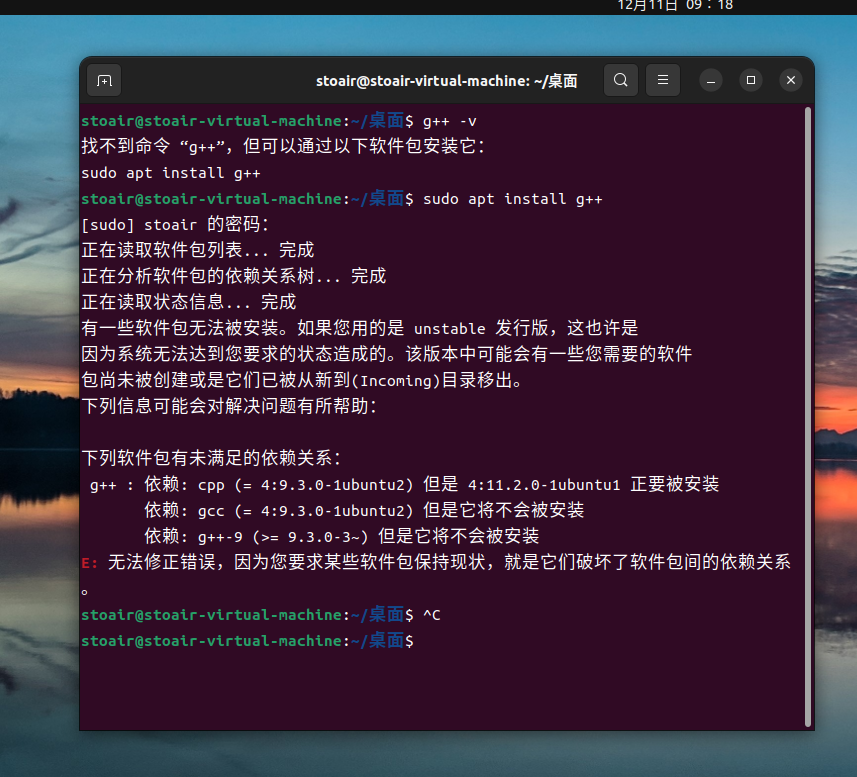
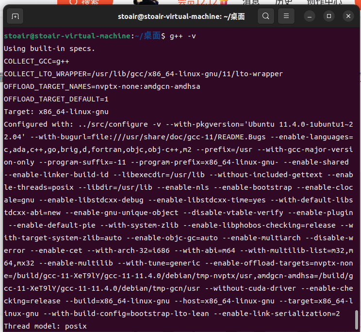
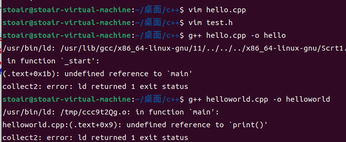
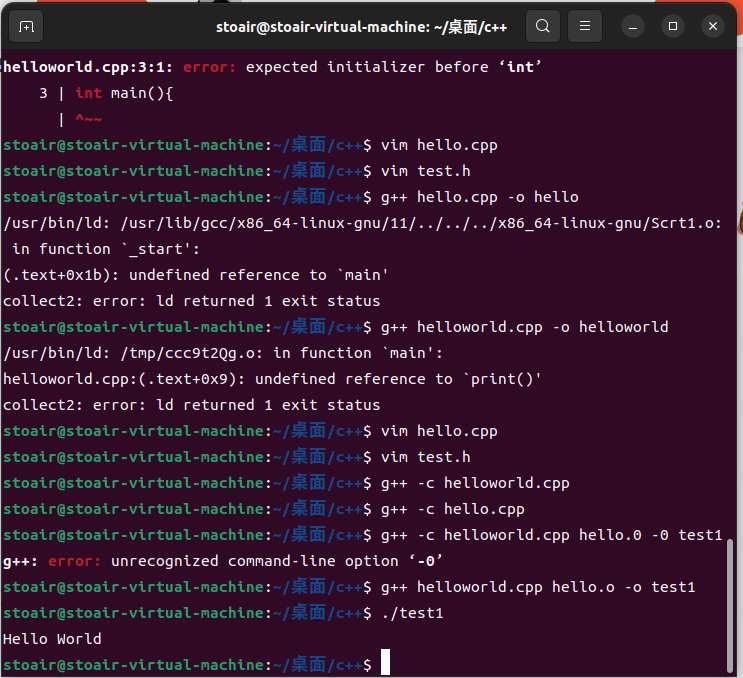
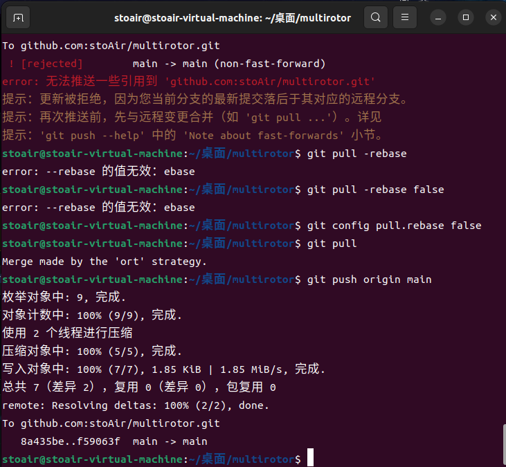

### G++

#### some command：

|command|meaning|
|-------------|-------------|
|-o outputfile file.cpp|编译为可执行文件|
|-c|编译为对象文件|
|-o outputfile file1.o file2.o|链接对象文件|

#### about .o files and .exe files：
对象文件和可执行文件的主要区别在于链接的程度：对象文件包含了部分链接的代码，而可执行文件包含了完全链接的代码。在一些大型项目中，源代码可能被分割成多个文件，然后分别编译成对象文件，最后再链接成一个可执行文件。这样的做法可以提高编译的效率，因为当某个源文件被修改时，只需要重新编译那个文件，而不需要重新编译整个项目。

```c++
g++ -o test1 hello.cpp helloworld.cpp
```
```c++
g++ -c hello.cpp
g++ -c helloworld.cpp
g++ -o test2 hello.o helloworld.o
```
```c++
g++ -o test3 hello.o helloworld.cpp
```
```c++
g++ -o test4 hello.cpp //wrong
```

***

### vim
_默认命令模式_

|command|meaning|
|:-------------|:---------|
|ESC|命令模式|
|gg / G/ 5+G|首行/末行/第五行|
|yy / p/ dd|复制/粘贴/剪切|
|u / ctrl + r|撤销/取消撤销|
|+i / +a|编辑模式|
|：/ wq/ q！|末行模式/保存退出/强制退出|

***

## The third day——12.12
### 1. install opencv
_怎么会有装起来这么麻烦的东西_

1. install cmake
2. use gedit 
3. install pkg-config

- question 1 : 装着装着虚拟机就死机了？
- solve : 强制重启，太智能了我直接执行下一个操作居然帮我帮上个死机没完成的操作自动执行
- question 2 : 检验时执行 pkg-config opencv --modversion 报错
- solve : 缺失了opencv.pc这个配置信息文件
手动创建opencv.pc
```
cd /usr/local/lib
sudo mkdir pkgconfig
cd pkgconfig
sudo touch opencv.pc
```
添加以下信息
```c++
prefix=/usr/local
exec_prefix=${prefix}
includedir=/usr/local/include
libdir=/usr/local/lib

Name: OpenCV
Description: Open Source Computer Vision Library
Version: 4.4.0
Libs: -L${exec_prefix}/lib -lopencv_stitching -lopencv_superres -lopencv_videostab -lopencv_aruco -lopencv_bgsegm -lopencv_bioinspired -lopencv_ccalib -lopencv_dnn_objdetect -lopencv_dpm -lopencv_face -lopencv_photo -lopencv_freetype -lopencv_fuzzy -lopencv_hdf -lopencv_hfs -lopencv_img_hash -lopencv_line_descriptor -lopencv_optflow -lopencv_reg -lopencv_rgbd -lopencv_saliency -lopencv_stereo -lopencv_structured_light -lopencv_phase_unwrapping -lopencv_surface_matching -lopencv_tracking -lopencv_datasets -lopencv_text -lopencv_dnn -lopencv_plot -lopencv_xfeatures2d -lopencv_shape -lopencv_video -lopencv_ml -lopencv_ximgproc -lopencv_calib3d -lopencv_features2d -lopencv_highgui -lopencv_videoio -lopencv_flann -lopencv_xobjdetect -lopencv_imgcodecs -lopencv_objdetect -lopencv_xphoto -lopencv_imgproc -lopencv_core
Libs.private: -ldl -lm -lpthread -lrt
Cflags: -I${includedir}
```
- question 3:编译时出现 fatal error ：opencv2/opencv.hpp:没有那个文件或目录
- solve : 将/usr/local/include/opencv4/opencv2扔到/usr/local/include/下

***

- question 4 ：上面的 solve 没有 solve
- quesiton ........
- sovle :卸载
- question 5 :  上面的 solve 没有solve

***

### 2. learn to use opencv and code to invoke the webcam

### 3.Abaut the total install of Opencv
_main error_
- error 1 :检测opencv版本报错
- solve ：手动创建opencv.pc
***
- error 2 : 编译fatal error ：opencv2/opencv.hpp:没有那个文件或目录
- solve ：将opencv2文件夹链接到include文件夹下
~~~
sudo ln -s /usr/include/opencv4/opencv2 /usr/include/
~~~
- error 3 :上述代码仍无法解决问题
- solve ：代码路径不准确
~~~
sudo ln -s /usr/local/include/opencv4/opencv2 /usr/local/include/
~~~
***
- error 4 : 编译通过生成目标文件，不能生成链接文件 报错 no input files
- solve ：g++用法错误

~~~
g++ -o webcam.o      //wrong
g++  webcam.o -o webcam  //wright
~~~

ps：百度搜不到解决方案，还得是gpt。
这个错误通常是因为你没有在编译命令中指定要编译的源文件。例如，如果你想编译一个名为hello.cpp的源文件，你应该使用以下命令：
```
g++ hello.cpp -o hello
```
在这个命令中，hello.cpp是要编译的源文件，-o选项指定了输出文件的名称，hello是输出文件的名称。如果你在命令中没有指定要编译的源文件，编译器就会报“no input files”的错误。确保你在命令中指定了正确的源文件名，并且文件存在于当前工作目录中。

***

- error 5 ：g++用法正确后报错undefined reference to`cv::VideoCapture::VideoCapture(int, int)'
- solve :链接时没有包含OpenCV库文件。要解决这个问题，需要在编译命令中包含OpenCV库文件
```
g++ yourfile.cpp -o yourfile `pkg-config --cflags --libs opencv`
```

***

- error 6 ：成功编译成可执行文件，但运行时报错error while loading shared libraries: libopencv_highgui.so.3.4: cannot open shared object file: No such file or directory
- solve ：有几个库找不到，用locate定位这几个库
~~~
sudo apt install mlocate
locate libopencv_highgui.so.3.4
~~~
找到后添加路径
```
cd /etc/ld.so.conf.d
sudo vim opencv.conf    //加入路径
sudo ldconfig
```
***
- error 7 : 想不起来还error什么了

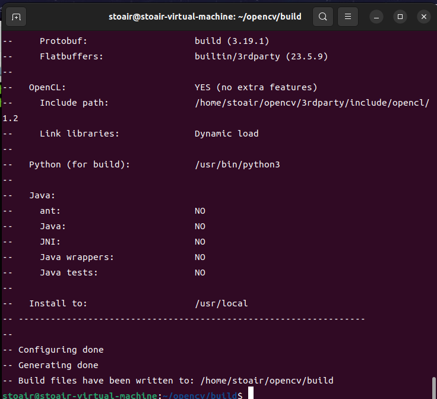
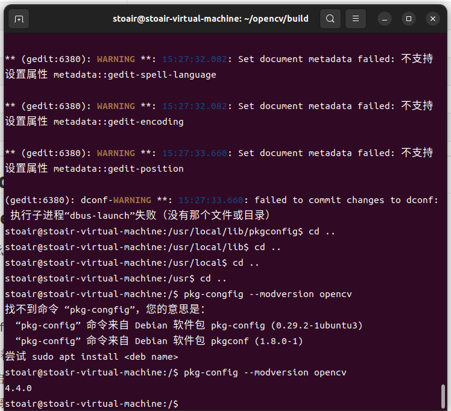
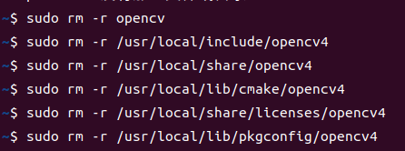
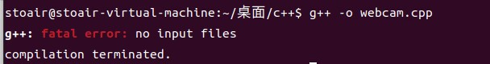


## The forth day——12.13
//最顺利的一集
### 1.install anaconda
error ：“conda”无法找到命令
solve ：导入路径才能使用
~~~
sudo gedit ~/.bashrc
export PATH="/home/用户名/anaconda3/bin:$PATH"
source ~/.bashrc
~~~
### 2.create  virtul environment
### 3.install pytorch

### Conda
|command|meaning|
|--------------|------------|
|conda env list|存在的虚拟环境|
|conda create -n your_env_name python=x.x|创建虚拟环境|
|conda activate your_env_nam|进入虚拟环境|
|conda deactivate env_name|退出虚拟环境|
|conda remove -n your_env_name --all|删除虚拟环境|

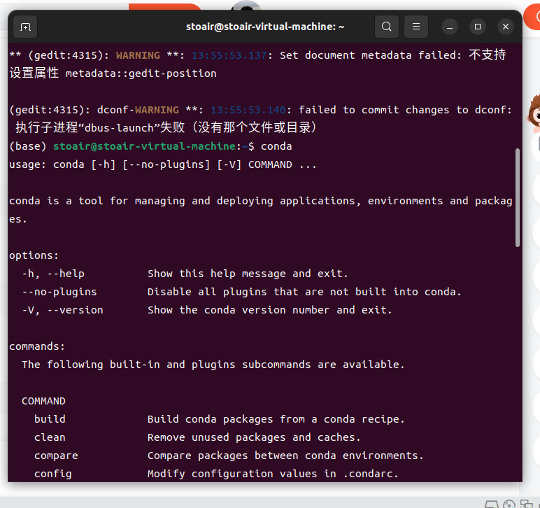
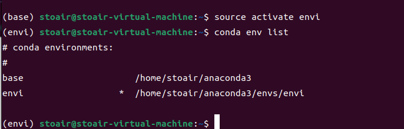
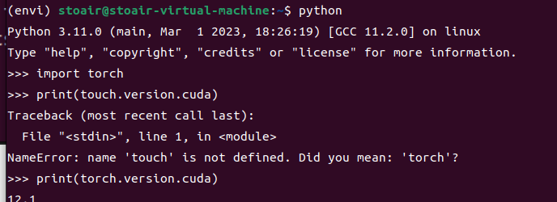

***

## The fifth day to The seventhday——12.14-16

***

### 1.搭建Ardupilot开发环境
### 2.启动SITL
#### -error ：运行奇慢无比
~~~
Tools/environment_install/install-prereqs-ubuntu.sh-y
~~~
solve ：挂着下一个晚上，第二天重下
#### - error：Failed to load module
1. TRY 1 ：//fail
~~~
sudo -H pip2 install --upgrade MAVProxy pymavlink future lxml
~~~
error :-H无法找到命令与目录
solve :在sudo命令中，-H标志是用来设置HOME环境变量为目标用户的家目录。这个标志是有效的，但是在某些情况下，可能会遇到"-H: 没有那个文件或目录"的错误。这通常是因为系统中的sudoers文件配置问题导致的。
如果遇到了这个问题，可能需要检查一下系统的sudoers文件配置。可以使用visudo命令来编辑sudoers文件，确保其中包含以下内容：
~~~
Defaults env_keep += "HOME"       //failed
~~~
***
2. TRY 2 ：//fail
~~~
sudo pip2 install --upgrade MAVProxy pymavlink future lxml
~~~
error ：pip2无法找到命令与目录
solve ：
~~~
sudo apt-get install python-pip
~~~
error： If executing pip with sudo, you may want sudo's -H flag
~~~
sudo chown root /home/gonglai/.cache/pip/http
sudo chown root /home/gonglai/.cache/pip
~~~
error ：Python 2.7 reached the end of its life on January 1st, 2020. Please upgrade
solve ：
***
3. TRY 3 ：//fail
From csdn:
python几个包未安装好，需要删除后重装
~~~
pip3 uninstall MAVProxy pymavlink future lxml
sudo -H pip2 install --upgrade MAVProxy pymavlink future lxml
~~~
***
4. TRY 4 ：//fail
From csdn：
mavproxy未安装好
~~~
sudo apt-get install python3-dev python3-opencv python3-wxgtk4.0 python3-pip python3-matplotlib python3-lxml python-pygame
pip3 install PyYAML mavproxy --user
echo 'export PATH="$PATH:$HOME/.local/bin"' >> ~/.bashrc
~~~
***
5. TRY 5 ：//fail
From csdn：
更换python版本，旧版本的mavproxy貌似不支持python3
添加python2到索引，并设置python2为默认的python版本
```
sudo update-alternatives --install /usr/bin/python python /usr/bin/python2.7 1
sudo update-alternatives --config python
```
***
6. TRY 6 ：//fail——>创建虚拟环境后需要重新安装依赖包
~~~
Tools/environment_install/install-prereqs-ubuntu.sh-y
~~~
创建虚拟环境
***
7. TRY 7 ：//wrong choice
重装
成功
***
#### SOLVE:
1. 创建python=3.9的虚拟环境
2. 安装依赖包
3. 找到缺少的python库   opencv-python  wxpython  matplotlib

#### - error：·运行几次后报错
运行`sim_vehicle.py --map --console`出现sim_vehicle.py无法找到文件与目录
Solve：

~~~
../Tools/autotest/sim_vehicle.py --frame singlecopter --map --console
~~~

***
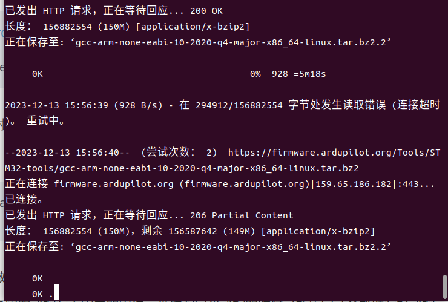
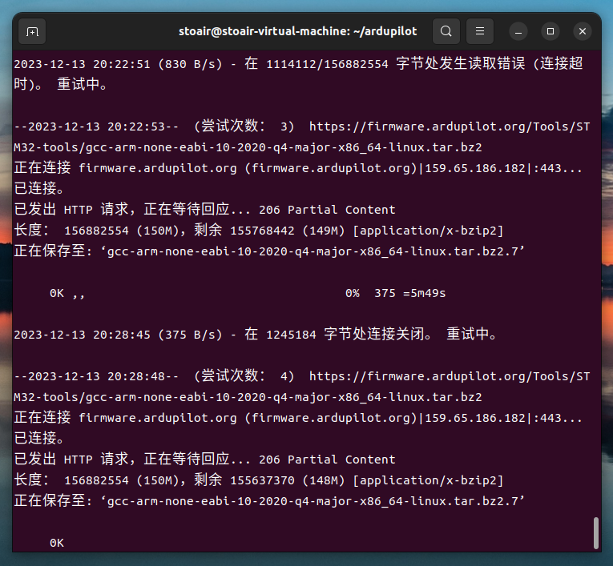
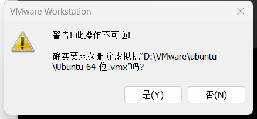

## The eighth day——12.17

***

### 1.安装nvidia和cuda
//fail 虚拟机装不了一点
### 2.下载yolo5代码和预训练模型

### 3.安装anaconda后再重启SITL仿真

#### -error ：再次无法打开consolo和map
solve ：安装opencv-python，wxpython，matplotlib库
#### -error ：安装wxpython时报错

ERROR: Could not build wheels for wxPython

TRY1 ：创建python=3.8的虚拟环境安装//fail ——>
TRY2 ：创建python=3.6的虚拟环境安装//fail
TRY3 ：安装旧版本的wxpython//fail
TRY4 ：创建python=3.9的虚拟环境安装//successful ——>

### 成功打开console和map


***

## The ninth day——12.18
***
### 1. .gitignore
#### 忽略规则优先级
1. 从命令行中读取可用的忽略规则
2. 当前目录定义的规则
3. 父级目录定义的规则，依次递推
4. $GIT_DIR/info/exclude 文件中定义的规则
5. core.excludesfile中定义的全局规则

#### 忽略规则匹配语法
~~~
空格不匹配任意文件，可作为分隔符，可用反斜杠转义
开头的文件标识 注释，可以使用反斜杠进行转义
! 开头的模式标识否定，该文件将会再次被包含，如果排除了该文件的父级目录，则使用 ! 也不会再次被包含。可以使用反斜杠进行转义
/ 结束的模式只匹配文件夹以及在该文件夹路径下的内容，但是不匹配该文件
/ 开始的模式匹配项目跟目录
如果一个模式不包含斜杠，则它匹配相对于当前 .gitignore 文件路径的内容，如果该模式不在 .gitignore 文件中，则相对于项目根目录
** 匹配多级目录，可在开始，中间，结束
? 通用匹配单个字符
* 通用匹配零个或多个字符
[] 通用匹配单个字符列表
~~~
#### 示例：
~~~
bin/: 忽略当前路径下的bin文件夹，该文件夹下的所有内容都会被忽略，不忽略 bin 文件
/bin: 忽略根目录下的bin文件
/*.c: 忽略 cat.c，不忽略 build/cat.c
debug/*.obj: 忽略 debug/io.obj，不忽略 debug/common/io.obj 和 tools/debug/io.obj
**/foo: 忽略/foo, a/foo, a/b/foo等
a/**/b: 忽略a/b, a/x/b, a/x/y/b等
!/bin/run.sh: 不忽略 bin 目录下的 run.sh 文件
*.log: 忽略所有 .log 文件
config.php: 忽略当前路径的 config.php 文件
~~~
#### 不生效情况
1. 已纳入版本管理
solve：删除本地缓存
```
git rm -r --cached .
git add .
git commit -m 'update .gitignore'
```
2. 添加文件被忽略
- 强制添加
```
$ git add -f App.class
```
- 检查gitignore
```
$ git check-ignore -v filename.
```
***
### 2. git lfs
#### LFS作用
Large File Storge，可以帮助我们管理比较大的文件，git lfs对于需要追踪的文件只会保存一个指向该文件的指针，而不是在本地仓库中保存每次提交的版本，节省了本地磁盘空间，缩小了git的传输时间。
它通过将大文件存储在Git仓库之外的服务器上，并使用指向这些文件的指针来跟踪和管理这些文件。这样可以避免Git仓库变得庞大和不稳定。Git LFS支持大文件的版本控制和协作，使得与大型二进制文件（如图像、音频和视频文件等）一起使用Git变得更加灵活和高效。
#### LFS使用
- 跟踪大文件
```
git lfs track "*.zip" 
```
- 提交前审核
~~~
git lfs ls-files
~~~
#### LFS实际应用
- 加快克隆速度
如果克隆包含大量 LFS 文件的仓库，显式使用 git lfs clone 命令可提供更好的性能
-   加快拉取速度
git lfs pull 命令批量下载 Git LFS 文件

***

## The tenth day ——12.19

***

### yolov5模型训练
#### 1. 下载数据集
- 解压.gz文件报错：EOF tar: 归档文件中异常的 EOF
solve：在windows下安装压缩为rar文件重新上传到网盘
#### 2. 训练数据集
- 训练过程中killed
solve：减小BATCH_SIZE ( 每epoch一次训练样本数量 )（ 32——>8 )；减小epoch数量 ( 100——>10 )
#### 3.测试训练后的权重


***

## Break 12.20-12.22

***

## The eleventh day ——12.23

### 双系统 install ubuntu

- error 1： file /boot/vmlinuz-linus not found
- solve ：以dd镜像模式写入U盘（推荐是iso镜像
***
- error 2 ：Ubuntu系统开机异常：ACPI Error：AE_NOT_FOUND 
- solve ：——>显卡不能完全支持操作系统中包含的开源驱动程序：在linux那一行最后三个—换成nomodeset；按ctrl+x 
- solve ：——>开机f2进入bios ，关闭安全启动模式:Secure Boot:Disable ，关闭独显。
***
|分区|大小|
|------|-----|
|boot/efi|1G|
|swap|两倍内存|
|/|150-200G不少于100G|
|/home|剩下所有|
***

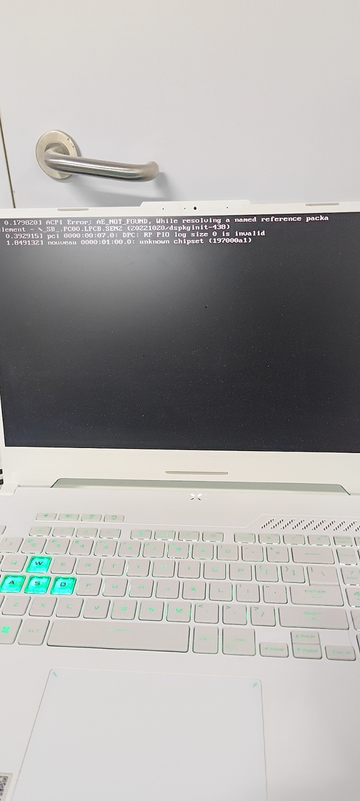

### 装完就可以卸载 ubuntu 了
1. windows删除ubuntu的卷
2. 删除Ubuntu启动引导项
①Win + R 输入cmd打开终端，输入 diskpart 进入磁盘工具
②输入 list disk 查看磁盘，输入 select disk 0
③输入 list partition ，输入 select partition n （Windows EFI分区，一般为260M）
④输入 assign letter=J（分配盘符）
⑤管理员模式打开记事本
⑥打开 J盘/EFI 文件夹，删除Ubuntu文件夹

